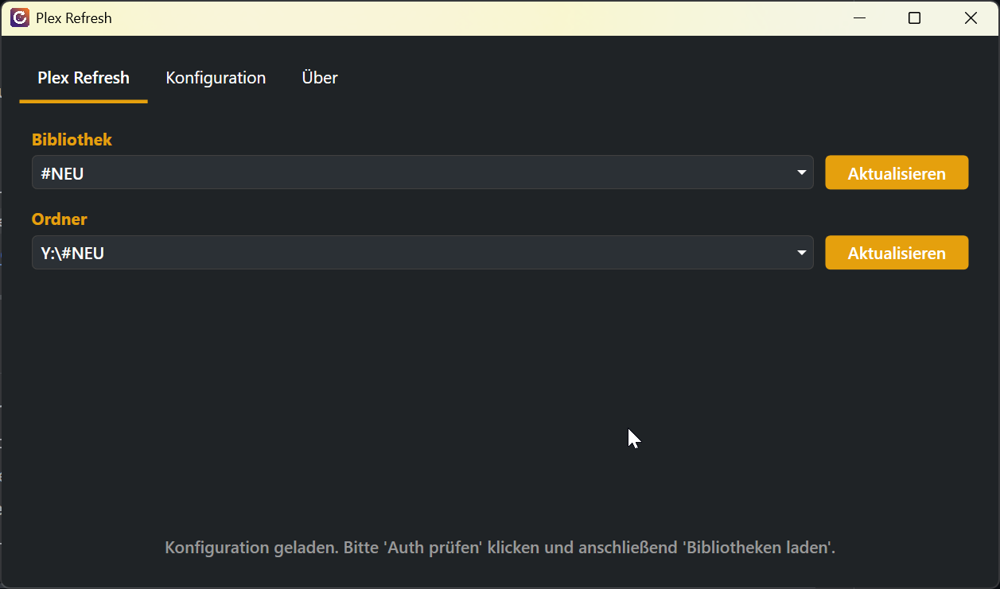

# Plex Refresh

Ein kleines Windows-Tool zum manuellen Anstoßen von Plex-Bibliothek-Scans — ohne den Plex-Web-Client öffnen zu müssen.




---

## Features

- **Bibliotheken auflisten** — alle Plex-Bibliotheken des konfigurierten Servers
- **Bibliothek aktualisieren** — kompletten Scan einer Bibliothek anstoßen
- **Ordner aktualisieren** — gezielten Scan eines einzelnen Ordners anstoßen
- **Konfiguration speichern** — Server URL und Token werden lokal gespeichert
- **DE / EN** — Sprachumschaltung per Klick

---

## Download

Unter [Releases](https://github.com/noyse27/plexrefresh/releases) steht die aktuelle Version als ZIP-Archiv bereit.

1. ZIP entpacken
2. `plexrefresh.exe` starten
3. Kein .NET-Installer erforderlich (self-contained)

**Systemanforderungen:** Windows 10 / 11 (64-bit)

---

## Einrichtung

### Plex Server URL
Format: `http://<IP-oder-Hostname>:<Port>`  
Beispiel: `http://192.168.1.100:32400`  
Standard-Port für Plex ist **32400**.

### Plex Token
Das Token dient zur Authentifizierung gegenüber dem Plex-Server.

So findet man es:
1. Plex Web öffnen und ein Medium abspielen
2. URL enthält `X-Plex-Token=xxxxx` — das ist das Token
3. Oder: [Anleitung von Plex](https://support.plex.tv/articles/204059436-finding-an-authentication-token-x-plex-token/)

---

## Verwendung

1. Tab **Konfiguration** öffnen
2. Server URL und Token eintragen, **Speichern** klicken
3. **Auth prüfen** — bestätigt, dass die Verbindung funktioniert
4. **Bibliotheken laden** — listet alle Bibliotheken auf
5. Tab **Plex Refresh** — Bibliothek oder Ordner auswählen und **Aktualisieren** klicken

---

## Build (aus dem Quellcode)

Voraussetzungen: [.NET 9 SDK](https://dotnet.microsoft.com/download/dotnet/9.0)

```bash
git clone https://github.com/noyse27/plexrefresh.git
cd plexrefresh/plexrefresh
dotnet build
```

Self-contained Release-Build:

```bash
dotnet publish -c Release -r win-x64 --self-contained true -p:PublishSingleFile=true
```

---

## Lizenz

MIT — siehe [LICENSE](LICENSE)

---

© PolzeSoft 2026 · [polze.net](https://polze.net) · [plexrefresh@polze.net](mailto:plexrefresh@polze.net)
